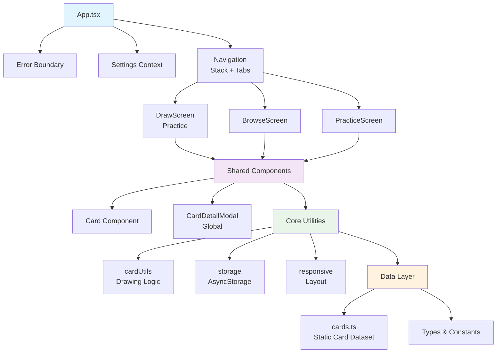
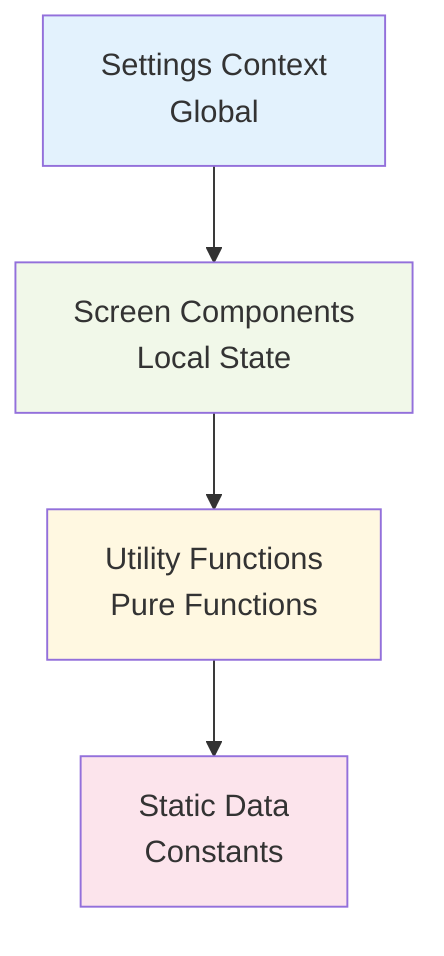
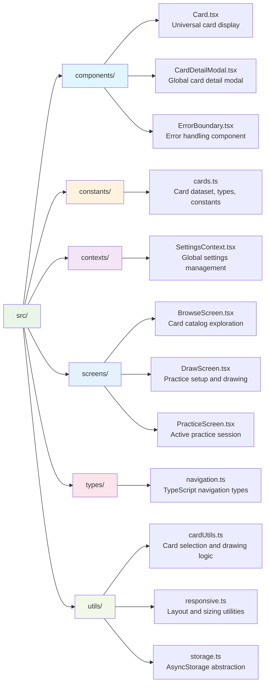

# Piano Improvisation Cards - Architecture Documentation

**Date:** 4 Sep 2025

## Overview

Piano Improvisation Cards (branded as "Unscored") is a React Native/Expo mobile application designed to enhance piano practice through creative constraint-based exercises. The app uses a card-drawing system that presents players with creative constraints across five suits: Mood, Form, Time, Pitch, and Position. This approach encourages musicians to break out of habitual patterns and explore new musical territories through structured improvisation.

## High-Level System Architecture

## Component Architecture & Relationships

### Core Application Structure

**App.tsx** - Root component orchestrating the entire application:

- **Error Boundary**: Catches and handles React errors gracefully
- **Settings Context Provider**: Manages global application settings
- **Navigation Container**: Houses both stack and tab navigation
- **Global Modal State**: Manages the shared CardDetailModal across all screens

### Navigation Architecture

The app uses a **hybrid navigation pattern**:

1. **Stack Navigator** (Root level):
   - `Main` screen (contains tab navigator)
   - `Practice` screen (modal-style screen for practice sessions)

2. **Tab Navigator** (Within Main screen):
   - `Draw` tab (Practice setup and drawing)
   - `Browse` tab (Card catalog exploration)

This pattern allows the Practice screen to overlay the tabs while maintaining tab state, enabling users to start a practice session from either the Draw or Browse screens.

### Screen Components

#### DrawScreen (Practice Tab)

**Purpose**: Configure and initiate practice sessions

- **State Management**: Uses SettingsContext for user preferences
- **Card Drawing**: Integrates with cardUtils for intelligent card selection
- **Settings UI**: Collapsible filter interface for customizing draws
- **Navigation**: Launches PracticeScreen with drawn cards

#### BrowseScreen

**Purpose**: Explore the complete card catalog by suit

- **Organization**: Groups cards by suit with responsive grid layouts
- **Exploration**: Allows detailed examination of individual cards
- **Integration**: Shares CardDetailModal with other screens

#### PracticeScreen

**Purpose**: Display drawn cards for active practice sessions

- **Card Display**: Shows selected cards in an organized layout
- **Reroll Functionality**: Allows users to redraw mood or technical cards
- **Modal Integration**: Provides detailed card information on tap

### Shared Components

#### Card Component

**Purpose**: Unified card representation across the app

- **Theming**: Suit-based color schemes and styling
- **Responsive**: Adapts to different screen sizes and contexts
- **Touch Handling**: Consistent interaction patterns

#### CardDetailModal

**Purpose**: Global modal for detailed card information

- **Shared State**: Managed at App.tsx level, accessible from any screen
- **Practice Integration**: "Practice This" button launches practice sessions
- **Rich Content**: Displays full card descriptions and metadata

#### ErrorBoundary

**Purpose**: Graceful error handling and user feedback

- **Crash Prevention**: Prevents app crashes from component errors
- **User Experience**: Provides friendly error messages
- **Development**: Detailed error reporting in development mode

## Data Flow & State Management

### State Management Philosophy

The app follows **React's unidirectional data flow** with minimal external state management:

### Settings Context Pattern

**SettingsContext** provides centralized settings management:

- **Persistent Storage**: Automatically syncs with AsyncStorage
- **Default Handling**: Graceful fallbacks for missing settings
- **Type Safety**: Full TypeScript support for settings structure
- **Loading States**: Manages initialization loading states

### Local State Patterns

Each screen manages its own UI state:

- **DrawScreen**: Filter visibility, temporary drawing states
- **BrowseScreen**: Scroll positions, selection states
- **PracticeScreen**: Reroll states, card interaction states

### Data Persistence Strategy

**AsyncStorage Integration**:

- **Settings Only**: Only user preferences are persisted
- **Graceful Degradation**: App functions fully if storage fails
- **Migration Support**: Settings merging handles app updates
- **Performance**: Minimal storage operations

## File & Folder Structure

### Key Design Decisions

#### Separation of Concerns

- **Pure Functions**: Card drawing logic separated from UI components
- **Component Isolation**: Each component has a single, clear responsibility
- **Utility Organization**: Related functions grouped by domain

#### Type Safety

- **Comprehensive Types**: All data structures fully typed
- **Navigation Types**: Stack navigation properly typed
- **Component Props**: All props interfaces explicitly defined

#### Performance Considerations

- **Responsive Hook**: Dynamic layout calculations
- **Memo Patterns**: Expensive computations memoized where appropriate
- **Minimal Re-renders**: State updates carefully scoped

## Technology Stack & Rationale

### Core Technologies

#### React Native + Expo (v53)

**Why chosen:**

- **Cross-platform**: Single codebase for iOS, Android, and web
- **Expo Ecosystem**: Simplified development, deployment, and updates
- **Native Performance**: Access to native platform capabilities
- **Mature Ecosystem**: Rich component libraries and tooling

#### TypeScript

**Why chosen:**

- **Type Safety**: Prevents runtime errors and improves code quality
- **Developer Experience**: Excellent IDE support and refactoring
- **Team Collaboration**: Self-documenting code and interfaces
- **Maintenance**: Easier refactoring and long-term maintenance

#### React Navigation v7

**Why chosen:**

- **Flexible**: Supports complex navigation patterns
- **Platform Native**: Platform-appropriate navigation behaviors
- **TypeScript Support**: Fully typed navigation parameters
- **Performance**: Optimized for React Native applications

### Supporting Libraries

#### AsyncStorage

**Purpose**: Persistent storage for user settings
**Why chosen**: Simple, reliable, and well-integrated with React Native

#### React Context API

**Purpose**: Global state management
**Why chosen**: Built into React, appropriate for limited global state needs

### Development Tools

#### Testing: Jest + React Native Testing Library

**Focus**: Core logic and utility functions
**Philosophy**: Test behavior, not implementation details

#### Code Quality: ESLint + Prettier + TypeScript

**Purpose**: Consistent code style and error prevention
**Integration**: Pre-commit hooks ensure quality standards

#### CI/CD: GitHub Actions

**Coverage**: Type checking, linting, formatting, and testing
**Platforms**: Tests against multiple Node.js versions

## System Interactions & Data Flow

### Card Drawing Process

1. **Settings Retrieval**: DrawScreen loads user preferences from SettingsContext
2. **Validation**: cardUtils validates available cards meet filter criteria
3. **Intelligent Selection**: Fisher-Yates shuffle ensures truly random, non-duplicate draws
4. **Navigation**: Drawn cards passed via navigation parameters to PracticeScreen
5. **Display**: PracticeScreen renders cards with reroll capabilities

### Settings Management Flow

1. **Initialization**: SettingsContext loads from AsyncStorage on app start
2. **User Interaction**: Settings UI updates local state
3. **Persistence**: Changes automatically saved to AsyncStorage
4. **Propagation**: React Context notifies all dependent components

### Responsive Design System

1. **Screen Detection**: useResponsiveLayout hook calculates device characteristics
2. **Dynamic Sizing**: Components adapt card sizes, fonts, and layouts
3. **Breakpoint System**: Tablet and large tablet breakpoints (768px, 1024px)
4. **Touch Optimization**: All interactive elements sized appropriately for touch

### Modal Management Pattern

1. **Global State**: App.tsx manages modal visibility and selected card
2. **Event Propagation**: Screens trigger modal via callback props
3. **Shared Component**: Single CardDetailModal instance serves all screens
4. **Navigation Integration**: Modal can launch practice sessions from any context

## Development Guidelines & Patterns

### Code Organization Principles

1. **Single Responsibility**: Each module has one clear purpose
2. **Pure Functions**: Utilities are stateless and predictable
3. **Composition over Inheritance**: Components built from smaller components
4. **Explicit Dependencies**: All imports clearly define dependencies

### Error Handling Strategy

1. **Boundary Components**: ErrorBoundary prevents app crashes
2. **Graceful Degradation**: App functions even when features fail
3. **User Feedback**: Clear error messages for user-facing failures
4. **Development Support**: Detailed error information in development

### Performance Optimization Patterns

1. **Memoization**: Expensive calculations cached appropriately
2. **Lazy Loading**: Components loaded only when needed
3. **Minimal Re-renders**: State updates scoped to affected components
4. **Responsive Calculations**: Layout calculations optimize for device type

## Future Architectural Considerations

### Scalability Bottleneck Prevention

**Current Risk Areas:**

- **Card Dataset Growth**: Linear growth in card filtering operations
- **Settings Complexity**: AsyncStorage operations could become frequent

**Mitigation Strategies:**

- **Indexing**: Pre-compute card indices by suit and difficulty
- **Batched Storage**: Group settings updates to reduce AsyncStorage calls

### Maintainability Focus Areas

**Key Architectural Decisions for Long-term Success:**

1. **Pure Function Design**: Card drawing logic easily testable and modifiable
2. **Component Isolation**: Screens can be modified independently
3. **Type Safety**: TypeScript prevents regressions during refactoring
4. **Clear Boundaries**: Separation of concerns makes feature additions predictable

This architecture prioritizes simplicity, maintainability, and user experience over clever technical solutions, ensuring the app remains reliable and extensible as it evolves.
